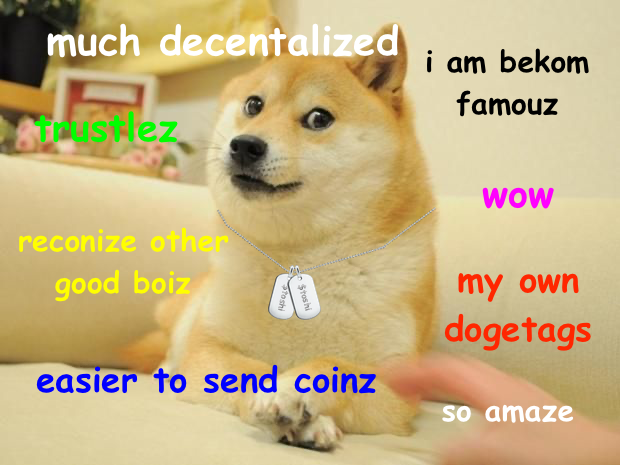

# Dogetags: A DNS for Dogecoin

Sending Dogecoin should be fun, easy and secure!

Dogetags are human-readable "Dogecoin usernames". Shibes can create their own Dogetags. Each Dogetag is linked to a Dogecoin address (which can be changed). Dogetags save shibes from passing around long, boring addresses. Dogetags are like Venmo and Square usernames, but for Dogecoin.

Dogetags are completely decentralized and trustless, and the Dogetag-to-owner mapping is stored on the Dogecoin blockchain. Wow!

# How does it work?

Each Dogetag has a static **registry address**. The registry address can be derived by anyone from a given Dogetag (explained below).

Registered Dogetags have an **owner address**. This is the address that should receive the Dogecoin that is sent to the Dogetag. The current owner can always reassign the Dogetag to a new owner.

## Initial registration

If nobody has claimed a Dogetag, the Dogetag can be registered by sending 0.00000001 Dogecoin (the smallest possible amount) to the registry address.

The sender of the first deposit received by the registry address becomes the first owner of the Dogetag.

## Change of ownership

Changing ownership is a two-step process:

1) The new owner sends a tiny amount of Dogecoin to the registry address. The amount has to be unique - the registry address should not have received a deposit of the same amount in the past.
2) The old owner sends the exact same amount of Dogecoin to the registry address to authorize the change of ownership. This must happen after (1).

## How to resolve the owner of a Dogetag

- Derive the registry address from the Dogetag (explained below)
- If the registry address has not received any deposits, the Dogetag has no owner
- If the registry address has received one deposit, the sender of that deposit is the owner
- If the registry address has received multiple deposits, determine the latest owner
  - Set `latest_owner` to the first sender
  - See if `lastest_owner` has transferred ownership as explained in "Change of ownership"
  - If yes, set `latest_owner` to the transferee, then repeat these steps

# How to derive the registry address

1. Calculate the SHA256 hash of the Dogetag
  - `02d08359f754fb6b3afcf916e7784a2a41eb8196f5c43d647e368aeb0ad47597` for `erik`
2. Concatenate `1ef` and the first 18 hex characters of the result of (1)
  - `1ef` and `02d08359f754fb6b3afcf916e7784a2a41eb819` = `1ef02d08359f754fb6b3afcf916e7784a2a41eb819`
3. Hash the result of (2) twice using SHA256
  - `ab91caa9e75364ef42ca8040d9bc943a27e750aee523bb5b3742c8dbf539649c`
  - `81240541c350ad904c2189e29d9c2728556b321ea37aefeb17010f7297daa922`
4. Concatenate the result of (2) and the first 4 bytes of the result of (3)
  - `1ef02d08359f754fb6b3afcf916e7784a2a41eb819` and `81240541` = `1ef02d08359f754fb6b3afcf916e7784a2a41eb81981240541`
5. Base58 encode the result of (4)
  - `DT32fBS74GRsEBvwhiqa5GLPRgSEMB1vqE`

The result of (5) is the registry address! The `1ef` prefix from (2) will make it start with `DT`.

Note that we have no way of knowing the private key of the registry address, so any amount of Dogecoin sent to the registry address is burnt.

Other than for registration and change of ownership, no Dogecoin should be sent to the registry address. The registry address is just used to store the Dogetag-to-owner mapping.

# Implementation

This is just a protocol - supporting Dogetags is up to wallets. Wallets can derive the registry address of a given Dogetag locally and query a block explorer to list all transactions received by the registry address. Then they can follow the steps above to resolve or register a Dogetag.

Wallets should always show the actual recipient address in the confirmation screen of a transaction in addition to the Dogetag. Dogetags do not have a checksum, so shibes must type them in correctly. Dogetags are great for small payments (like tips).
